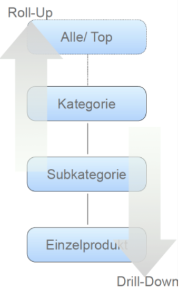

#Lektion 2

####Was ist ein DWH? Kann man das einfach so kaufen?

Es ist eine Sammlung von verschiedenen Softwarepaketen, welche es uns ermöglichen die benötigten  Daten analysieren und evaluieren können.

##Usecase: Marketing Analyse

Ausgangslage: Eine Firma möchte ein Product lancieren; Welche potenziellen Kunden würden das Produkt kaufen? Lohnt sich das ganze?

Ansatz:

* Erstellen eines Marketing Data Marts mit Informationen über
	* Produkte
	* Kunden
	* Transaktionen
* Das neue Produkt wird mit ähnlichen Produkten verglichen
* Kunden, die ähnliche Produkte gekauft haben, werden analysiert

Das heisst aus den bestehenden Daten können Schlüsse gezogen werden.

Das Resultat ist eine Tabelle, welche sehr dynamisch ist. Es wird ermöglicht auf die Daten einzugehen, welche einem besonders interessieren.

---

##Sternschema (Kennzahln, Fakten, Dimensionen)

Vorteile:

* Höhere Abragegeschwindigkeit, da weniger und einfachere Joins benötigt werden
* Grund: Denormalisierung der Daten
	* Nicht in dritter Normalform, Daten werden innerhaln einer oder mehrerer Tabellen dupliziert
	
Sternschemata haben 2 Arten von tabellen:

* Faktentabelle: Enthäkt Fremdschlüssel auf Dimensionstabellen
* Dimensionstabellen: Gelten als msterdaten und beinhalten Primärschlüssel die mit der Faktentabelle verknüpft werden

-><-

	 
In der Mitte sind die Fakten, welche keine Bedeutung haben. Die Dimensionstabellen erklären dann was die Kennzahlen genau bedeuten.

Faktentabellen:
Beinhalten harte numerische Attribute; bei Verkäufen, was und wieviel. Sie sind also sehr schmal, aber seeeeehr lang.

#####Kennzahlen: Spezielle Fakten
Kennzahlen sind die Grundlage für fachliche Auswertung:

* Banken:
	* Net new Assets
	* Assets under managemtn
* Telekommunikation
	* Average Revenue per user
* eBusiness
	* Click trough rate

Kennzahlen sind **Aggregate** über einen bestimmten Zeitraum, d.h. keine Einzelbetrachtungen.
Es interessiert uns nicht was Herr Meier gemacht hat, es interessiert uns wieviele Produkte X am Tag Y in der Ortschaft Z abgesetzt wurden.

#####Dimensionen
Sie geben den Kontext zu den Fakten

* Ansammlung von Daten, die die Fakten von eoner bestimmtem Sicht aus beschreiben
* Dimensionen beschreiben den **kontextuellen Hintergrund** von Fakten
* Dimensionen dienen der **Klassifizierung** von Fakten


####Beispiel:
Liste aller Verkäufe von iPhones in Zürich

-><-

SQL: 

	SELECT sales, profit
	FROM fact AS F, product AS p, region AS r
	WHERE f.prod_id = p.prod_id
		AND f.res_id = r.region_id
		AND p.prod_desc = 'iPhone AND r.city = 'Zurich'
		
=> Easy

Liste aller Verkäufe von iPhones pro Kanton?

SQL:

	SELECT SUM(sales), SUM(profit), state
	FROM fact AS F, product AS p, region AS r
	WHERE f.prod_id = p.prod_id
		AND f.res_id = r.region_id
		AND p.prod_desc = 'iPhone
		GROUP BY r.state
		

#####Eigenschaften des Sternschemas
* Faktendaten werden typischerweise sehr gross
	* Milliardern von Records
	* Partitionierung der Faktentabellen und Auslagerung alter Records
* Fakten sollen sich auf fachlichen Prozess veschränken, z.b. Verkauf
* Dimensionstabellen sind typischerweise nicht so riesig, haben aber ggf. viele Attribute

---


##Hierarchien
Hierarchische Beziehung: Produkt -> Subkategorie -> Produktkategorie

####Drilling (mehr Details anzeigen)

* Hierarchie von oben nach unten traversieren
* Alle Produkte -> Kategorie -> Subkategorie -> Produkt

####Roll-Up (weniger Details anzeigen)

Hierarche von unten nach oben traversieren

-><-	

Drilling in SQL ist das Hinzufügen und Wegnehmen von ```GROUP BY```


####Slicing
Ausschneiden von Scheiben aus einem "Cube"

---

##Zeitdimension

Fast jedes Sternschema enthält eine Zeitdimension

Der Datentyp DATE stellt zu wenige explizite Merkmale zur Verfügung.

**Warum?**

Normalerweise kann man das berechnen, aber das Kernziel hier ist dass man denormalisiert und die Abfragen somit beschleunigen kann.

**Wie wird sie gebaut?**
Sie werden durch Skript erstellt. Man braucht keine Informationen von extern. Es ist dann egal, wenn manche Tage nicht mit einem Fakt verbunden sind.

Es werden oft Daten von den letzten 10-20 Jahren gespeichert.

#####Beispiel ohne Zeitdimension

* Anzahl der Verkäufe von iPhones im 3. Quartal 2014
* Anzahl der Verkäufe in der ersten 5 Tagen jedes Monats

-><-

#####Beispiel mit Zeitdimension

-><-

---

##Conformed Dimensions

Wenn mehrere unterschiedliche Fragestellungen sollen ausgewertet werden, evtl. mit verschiedenen Sternschemata

"A conformed dimensions is a dimension that has exactly the same meaning and content when being reffered from different fact tables"

---

##Fazit

* Fakten sind die "WHAT"s: alles was wir messen
	* in der Regel nummerisch
	* Umsatz, Bestellungen, Lagerbestand
* Dimensionen sind die "BY"s: danach wird qualifiziert / gruppiert
	* Zeit, Produkt, Organisation, Geographie, Dienstleistung