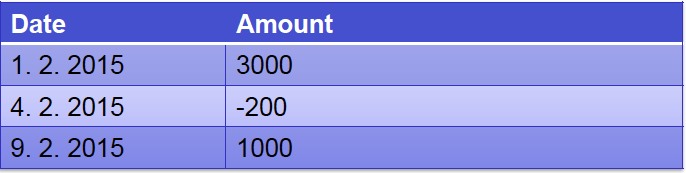
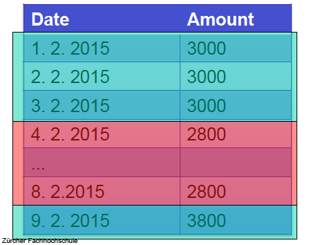
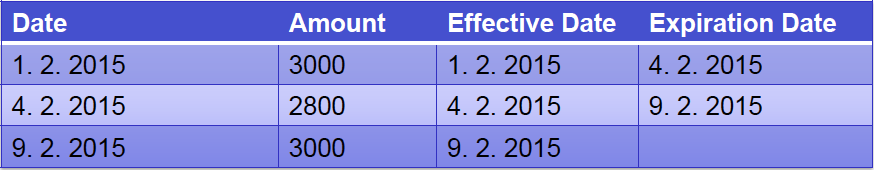
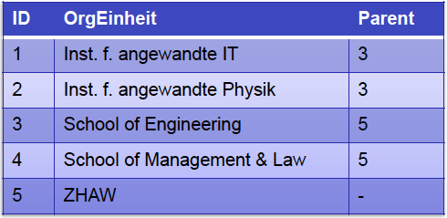

#Lektion 3 - Decision Support Systems

##Ziele

* Kennen von Sternschema Fakten- und Hierarchien
* Verstehen von Historisierung und Slowly changing dimensions

##Typen von Fakten

* Fakten sind quantifiziert
	* Meist betriebswirschaftliche Grössen
	* Beschreibende Attribute sind ebenfalls relevant (Einheiten)
* oft nur Kennzahl "Anzahl"

##3 Typen von Modellierungen

###Transaction
-><-

###Periodic Snapshot
-><-

###Accumulating Snapshot
-><-

##Dimensionen mit Hierarchien

###Parent-Child Hierarchien

* Parent-Child Hierarchien sind typischerweise Baumstrukturen

-><-

##Historisierung

Warum wollen wir alle Daten abspeichern?

* Manchmal ist es erwartet vom Gesetz
* Man will nachvollziehen wie sich die Daten ändern

###Slowly changing Dimensions

* SCD type 1 (Overvwrite)
* SCD type 2 (new record)
	* Neue Zeile wird eingefügt
* SCD tpye 3 (current value field)
	* der urprüngliche wert wird in einer speziellen Spalte eingetragen
	
###Monotemporale Historisierung
Jeder Datensatz enthält eine von und bis Daten-spalte
