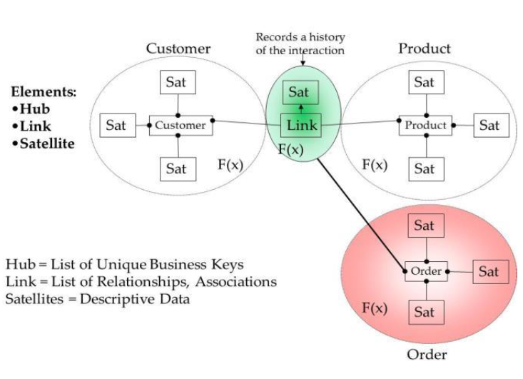

#Lektion 4 - Architekturansätzte

## Ziel

* Was sind die Bausteine
* Wie wendet man sie richtig an
* kennen und verstehen die Architekturmuster die in der DWH Architektur angewendet werden

##Warum braucht man eine Architektur?

* Für kleine Projekte kann man einfach drauflos programmieren
* Sobald das Projekt aber grösser wird, bekommt man ein Durcheinander
	* niemand kommt mehr draus
	* man baut immer mehr Mist auf Mist auf

Es kommt das sogenannte "Spinnennetz" muster zustande

##Was gibt es generell für Muster?

Generell sind dies Verbindungsprobleme

* Hub and Spoke
* Pipes and Filters
* Publish and subscribe

##Wie kommt man zur DWH Architektur

### Virtual Data Warehouse

* menge von Views auf operativen Datenbanken
* nicht alle Aggregationen sind materialisiert
* Direkte Extrakte aus den operationellen Systemen, Fokus auf Query und Performance
* Die Daten werden immer on the fly berechnet
* Man macht dies, damit man schnell an die Daten kommen kann anstatt zu warten, bis die Daten wieder aggregiert wurden im DWH
* Wird in der explorativen Phase verwendet, aber man sollte möglichst schnell davon abkommen indem man das gut modeliert

####Vorteile
* Quick win für erste Auswertungen
* Tiefe Kosten für den ersten Schritt

####Nachteile
* Adressiert Datenqualität nur beschränkt
* Keine Trennung der Aspekte Transaktion und Analyse
* Keine oder nur wenig historisierte Daten

###Datamarts

Formen

* independent: Direkt aus operationellen Systemen gefüttert
* dependant: Teilmenge des DWH

-> schnell und einfach implementiert; es ist ein reiner Quickfix!

###Ziel:

-><-

##Die drei grossen Muster die verwendet werden

###Inmon
* Man braucht ein integriertes Datenmodell mit allen Unternehmensdaten
* Baut die Marts danach

-><-

**Idee**: Baue ein zentralles DWH (dritte Normalform)

* Nicht alle Daten aus Quellsystemen müssen gespeichert werden
* Daten werde in das Enterprise Datawarehouse geladen
* Aus dem DWH werden die Data Marts geladen (Sternschema)

**Verwendung**

* für Grossbetriebe
* spart bei vollständiger Integration am Ende Kosten
* Wenn man Refferenzdatenmodelle verwendet kann der Prozess vereinfacht werden.

###Kimball
* Man braucht kein integriertes Datenmodell, nur Teile der Unternehmensdaten
* Starschema ist für ihn ausreichend

-><-

###Welches soll man nun wählen?

-><-

-><-

##Kompromiss: Hub and Spoke

-><-

Daten können stets hinzugefügt werden, ohne die bestehenden Daten verändern zu müssen indem man einen neuen Sateliten erstellt, welcher mit dem Foreign Key verbunden werden.

Die Hubs sind nur ganz kleine Tabellen. Die eigentlichen Infromationen stehen in den Sateliten.

