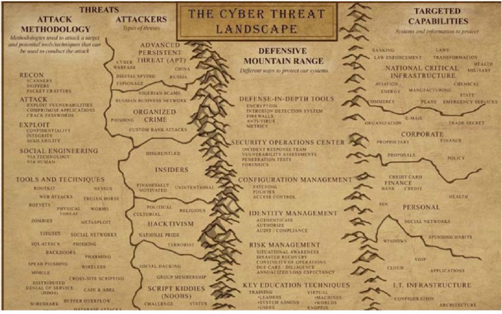
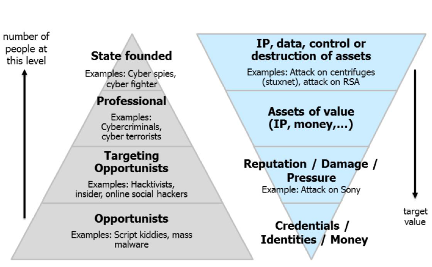
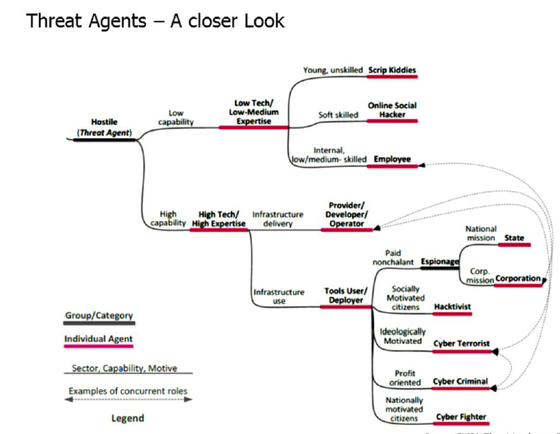

#Lecture 2 - Threat Landscape

##Goals

* Threat landscape:
	* Definition
	* Motivation
	* Threat Agents
	* sources of information
	* Some trends
	* Advanced persisten Threats (APT)
* You know what a Threat landscape is
* Know the taxomomy
* Able to explain what the cyber kill chain is and what use it has

---

##Threat Landscape

It's about threats and it is a landscape. You know how the situation looks like. You have to know hte landscape to be able to fight in it.

Threat Information:

* **Threat types**: DDoS, phishing etc
* **Targetet assets**: what is targetet? Can range from a website to a smartphone
* **Threat agents**: Who's the attacker? Some pose a threat intentionally, some don't know what they are doing and pose a threat that way.
* **Attack vector**: description usually based on the kill-chain. How does an attack find it's way into a system.

####Motivation
Knowing and tracking the landscape means:

* You know the weapons and tactics
* You know different types of threats and their capabilities
* You know what threats are considered most relevant
* You learn about new attack trends, tactics and techniques

Note: the knowledge is always incomplete; you only know what is known and published. Usually new discoveries get published only after years, for example when agencies are targeted.

Knowing the threat landscape is important because:

* it helps you to prepare for current and emerging threats
* it helps to understand and estimate the risk faced by an organization
* it can help to motivate investements in security controls

-><-

---

##Threat agents

-><-

The further down the less skill they have, but the more they are. But it costs more to defend against more skilled people.

-><-

####How to characterise a Threat agent

* Motivation
* Resources
* Skill level
* Role
	* Infrastructure delivery
		* Developer of malware
		* Provider
		* Operator
	* Infrastructure of a user
		* user / deployer
		
###Threat agent: Cyber criminals

#####Motivation
Usually Money and Intelligence (with the goal of money aswell)

#####Resources
Medium to large time and money; Could be a single person or an organized group with a hiararchy which have a lot of different skills (not just hacking, but also social engineering etc.). The organizations could also be on site, which is even more dangerous

#####Skill level
From medium to very high

#####Roles
Developer, Provider, Operator, User/Deployer

#####Types of activities

* Fraud
* Sell breached data (emails, credit cards)
* *-as-a-Service
	* Access-as-a-service: Pay to access the target of your choice; VERY prestigious and well payd
	* Exploitation-as-a-service:
		* Develop and sell exploits
		* run an exploitation service (pay per hit, pay per install)
		* but brings quite a lot of management for your hack
	* Malware-as-a-service: usually a complement to the Exploitation
	
	
###Threat Agent: Cyber spies (nation states / corporations)

#####Motivation
Intelligence, competitive advantage

#####Resources
Large to very large time and money budget

#####Skill level
From medium to very high

#####Roles
Developer, Provider, Operator, User/Deployer

#####Types of activities

* Espionage to gain a political, military pr economical advantage
* Cyber offense to deter adversaries and to gain a military advantage

ENISA definition is probably too narrow and does not seem to include offensive activities of nation states

Usually very advanced - most activities have only been uncovered by whistle blowers or by data leaks. But when and where do they use their capabilities? They probably won't use it for mass surveilance, because the chance of getting detected is increasing and they don't want to give that advantage away undless you can use it in a way where you can't find it.

####The arsenal of the NSA

* FIREWALK: A device that looks like a RJ45 socket that allows data to be injected or monitored and transmitted by radio technology using the **HOWLERMONKEY** RF trancieve
* BULLDOZER: hidden wireless bridge that allows remote access
* DROPOUTJEEP: implat in the iPhone that provides SIGINT functionality
* IRATEMNOK: infiltrates firmware of Harddisks
* IRONCHEF: infects networks by installing itself on computer BIOS

###Threat Agent Online social hacker

Considered to be part of the cyber-criminal threat 

#####Types of activities

* Exploiting the human to deploy cyber threats
* Profiling of candidate victims to enable targeted attacks

They analyse/understand behaviour and psychology of social targets

* they know how to make a victim believe that what it is asked to do is totall ok and that it has to be done
* they also know what sources of information people trust and how to exploit this trust

You don't need to have a profound technical knowledge to be a social hacker; usually you can exploit the psychology pretty easilly

###Threat agent Employee

#####Motivation
Extortion, revenge, sabotage or profit

#####Resources
Low

#####Skill level
low 

#####Roles
user / deployer

It is usually a good idea to have happy employees in your company to mitigate the threat

###Threat agent Script kiddie

#####Motivation
Thrill, fun, fame, profit

#####Resources
Low

#####Skill level
unskilled/low

#####Roles
user / deployer

#####Types of activities

Use free or purchased hacking tools and services

Consumerization of cybercrime might contribute toward getting them involved in more security incidents

Not too difficult to defend against :)

###Threat agent Other

* Hacktivists get information from organizations or people in power in order to embarass or to raise public awareness
* Cyber Fighers are nationally motivated and may move tin the interstellar space between terrorists, activists and espionage
	* motivated by nationalistic purposes, which **THEY** think are right, nobody makes them do those things
* Cyber Terrorists
	* Narrow: deplyments of disruption attacks against information systems for the primary purpose of creating alarm and panic by **known terrorist organizations** (=> no know incidents so far)
	* Broad: intentional use of computers, networks and public internet to cause destruction and harm for poilitical or ideological objectives
	* no commonly accepted definition exists
	* Experts say it will become more of a problem in the near future
	
---

##Cyber Kill Chain

It gives us an idea how an attacker in the threat landscape will attack us.

It shows you where you can counter the attacker or at least make it more difficult. If you can kill any of the components, the attack won't happen. Every single component has to happen for the attack to be successfull.

####The way of the attacker

1. Reconnaisance:
	* Gather information on the target before the actual attack (internet, onsite etc.)
2. Weaponize information:
	* Uses an exploit that creates a malicious payload to send to the victim, which is tailored for the specific target (can last hours to months)
3. Delivery:
	* the attacker delivers the malicous payload to the victim
	* using an USB-Stick, Email, website or other means
4. Exploitation:
	* Exploitation of a vulnerability to automatically execute the delivered payload
	* only relevant when the attacker uses an exploit to deliver the malicious payload
5. Installation:
	* installation of the malware on the target computer
	* only relevant when the attacker uses malware as part of the attack
6. Command and Controll
	* Creation of a command and control channel to continue to operate internal assets remotely
	* this step is relatively generic and relevant trhought the attack, not only when the malware is is installed
7. Action on objectives
	* Steps to achieve the actual goal inside of the victims network
	* this is the elaborate active attack process that takes months and thousands of small steps in order to achieve the objectives

---

##Sources of information about threats

#####Longterm

Threats are publshed once or a few times a year.

* to make strategical or longterm decisions

You can access threat databases

* to assist with incident investigation and threat research

#####Shortterm

* Focus on "real-time" information
* Articles on news portals
* Security mailing lists
* Threat intelligence service providers
* Threat intelligence platforms
	* aggregation and correlation of threat data from threat intelligence service profiders
	* Actionable / machine readable data that can be automatically fed into a security system
	
###Threat taxonimy

* It's a classification of threat types at various levels
* useful for a common understanding
* it's dynamic

Also lists the top 15 threats and their trends

##Threat trends

**Warning**: this might not be the newest ones, since you only know after a few years what exactly is happening.

* performing persistent attacks based on hardware, far "below" the radar of available defence tools and methods (hides in harddisk firmware)
* Enhancements in the provision of "Cyber-crime-as-a-service": Tool developmnt for nont experts and affiliate programs
	* you make malware available to users and give back some money to the "partner"
* Broadening of attack surface (Rooters, IoT etc)
* Improved malware weaponization and autimated tools to detect and exploit vulnerabilities
* Campaigning with highly profitable malicious infrastructures and malware (you get an easy to use interface for non-technical people)
* **ASSUME YOU HAVE BEEN HACKED ALREADY**

##Advanced Persistant Threats (APT)

Use advanced tehnologies and techniques

* can and will penetrate existing defenses and is VERY HARD to detect
* Operators develop more advanced tools as required
* Multiple targeting methods, tools, and techniques to reach and compromise a target and maintain access to it

Persistent: 

* it keeps trying until is succeeds
* Hides from detection
* maintain long-term access

Usually VERY well funded and engineered

