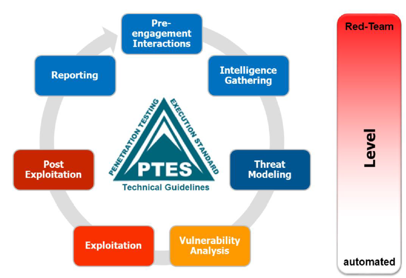
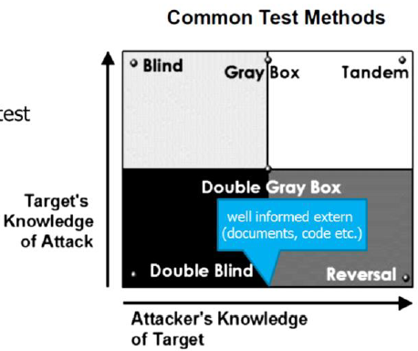

#Lecture 3 - Penetration testing

##Goals

* You know waht penetration tests are and have learned the basiscs to them 
* You know the methods and tools to do penetration tests and can explain important parameters (scope, rules of engagement, test methods etc.)
* you are aware of the standards

##What is a penetration test?

Several definition exist:

Penetratoin testing is security testing in which assessors mimic real-world attacks to identify methods for circumeventing the security features of an application, system or network.

Penetration test is the simulation of an attack on a system, network, piece of equipment or other facily with the objective of _proving_ how vulnerable that system or "target" would be to a real attack.

Proving has to be considered together with the scope... it's very hard if not impossible to quantify. Also your assesment s only true for a short time, i.e. the time you made the analysis.

#####A more business oriented definition

A penetration test serves to analyse the entire or designated parts of the IT-environment of a company with the goal to find and explit vulnerabilities and to identify the business risk associated with them.

##Motivation
Reasons vary a lot

* Find holes ind your denfenses before attackers do
* Test defenders to succesfully detect and respond to attacks
* raise oveall security awareness
* very secure system configurations and/or test new technology
* Discover gaps in compliance posture and statisfy legal and governmental requirements
	* usually a very basic one, because the people just need to make a chek in a report that tehy have done a pentest
	
##Focus and Acope
######Common types:

* Hacking and controlling IT assets
* getting access to a certain piece of information
* penetration physical security (extract key from smartcard)
* social engineering (convincing someone to open an attachment)

######It has a clear but limited scopes

* web application penetration test conducted only from the point of view of the internet browser
* try to access a system managing the bank accounts of non-Swiss citizens from an outsider's point of view

######Success factors
Experience, skills, wherewithal, lateral and out of the box thinking.

**Vulnerability scaning or compliance audits are NOT pentests!**

###Classic pen-testing cycle

* Reconnaissance
* Threat modeling and vulnerability analysis
* Exploitation/Pnetration
* Reporting

##How to pentest?

* Open source security Testing Methodology Manual (OSSTMM)
	* read this and get certified if pentesting is your companies main business
* OWASP Testing Guide (V4.0)
	* for testing web applications
	* Has hands-on advice
* NIST SP800-115 Technical Guide to Information Security Testing and Asssesment
* Penetration testing execution standard (PTES)
	* Explains basic principles
	* includes both detailed instructions and framework diagrams
	* **PTES is the basis for this course**
* There are a lot of other ressources too on the internet

-><-

##Preengagement Interactions
* Scoping
* Rules of engagement

###Scoping

* Defines what is to be tested
	* an in.depth test of a single application attacked over the internet ithout the help of emloyees? (deep but small coverate)
	* test widerange IP adresses to find a way into the company network.
* outlines how the testers should spend their time

The customers usually don't know exactly what they want and the challange is to find this out.

######What
* information about vulnerabilities and the risk
* reccomendations on how to fix the security
* a checkmark in a checkbox
* discredit someone in a different department

######Why
* suspects that tehy have a serious security problem
* to meet compliance
* because management wants products/services pentested before going live (usually veeery short timescope)
	* if you find a high risk the management is usually in a big problem if you find it

####Common types
* Network (e.g. try to get into the intranet)
* Web application (e.g. get access to customer data)
* wireless network
* physical (e.g. enter a secured area and access a specific asset)
* social engineering

####What the means used to interact the assets should be
* human
* physical
* wireless
* telecomunications
* Data networks

####What is Tested and How?

* what assets are included/excluded from the test
	* the entire web application except the billing
	* list of IPs to be tested
* are assets of third parties are affected? Which? (need to be **VERY** careful here)
	* cloud services
	* internet service provider
	
=> check terms of sevice

=> check mpact on test results (e.g. filtering malicious traffic, DoS etc.)

####Common test methods
* blind: war gaming, role play
* Double Blind: blind box, classical penetration test
* Gray Box: vulnerability test
* Double Grey Box: whitebox testing
* Tandem: crysta box testing
* Reversal: Red Team Experience

 -><-
 
 
####How do you define the scope?
* use a questionaire to guide the process of defining the scope
* PTES provides lists with questions
	* the lists are far fom complete but a good starting point

####Risks of scope defining
**Scope creep**:
Extentions/alteration of the scope requiring more time and effort

-> don't give in to the customer

####Communication 
* People onn the list of contacts
	* all penetraion tsters
	* the manager
	* Two technical contacts at each target organization
	* Two technical contacts at the customer
* Incident reporting Process
* Status report frequency
* PGP and other alternatives

##Rules of engagement
* identifies work items and resources (people, equipment)
* Synchronization times
* Timeline
* status meetings
* Time to test
* use of evasion/stealth techniques
* evidence handling

####Sensitive information
Get the permission to test!!!!!!

* Do not store/access personally identifiable information
* do not store/access sensitive personal information

But how do you prove it?

* Screenshots of the database schema (not the data)
* screenshot of the file permissions along with the current user
* capture a piece of information (flag) placed there for this purpose

 

 

