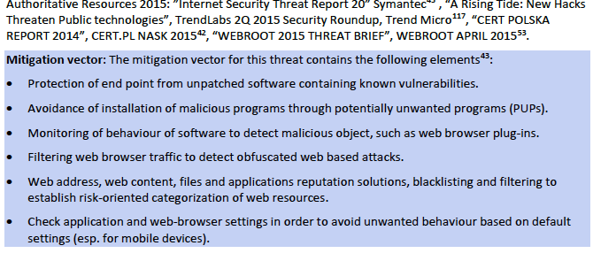

#Lab1

1 Why does ENISA release this report? What is the motivation?

ENISA seeks to enhance existing expertise in the EU member states by supporting the development of cross-border communities commited to improving network nad information security troughout the EU.

2 What is the target audience? To whom do you think is this report most relevant and why?

This document is directed towards:
	
* security professionals
* security experts
* decision makers
* non-experts
* security managers
* security architects

3 What sources of information have been used to compile the report and does the report provide a list of all of the resources used?

The information comes from:

* Agency studies
* Vendors
* R&D NGO analysis
* CERT Advisories
* Feed services
* states

4 Is there any information about how the sources of information collected the threat-information themselves?

No

5 Do you consider the source of information as trusted and free of conflicts of interest? Why?

We consider the information to be trusted, yet we are not convinced that it's unbiased, since the vendors are also a source of information.

6 The report mentions a field called “threat intelligence” – What is it and how is it integrated in the “daily business” of an organization?`

Threat intelligence is the data you collect about the threats and it

* Simplify content of threat intelligence to achieve wider uptake in the stakeholder community.
* Elaborate on threat agent models and make it inherent part of threat intelligence.
* Create correlated, contextualized threat information to increase timespan of relevance.
* Continuously adapt protection and detection tools to the threats.
* Invest in better vulnerability management and exploitation of dark web.

7 What is STIX, what are its four use cases (you might need to consult the homepage of STIX to find out) and how does it map to what ENISA uses?

Structured Threat Information eXpression (STIX™): A structured language for cyber threat intelligence.

Use cases:
* Cyber Threat Prevention
* Cyber Threat Detection
* Incident Response

8 What definition of risk is adopted by the report?

As regards risks, we adopt the definition according to the widely accepted standard ISO 27005: “Threats abuse vulnerabilities of assets to generate harm for the organisation”. In more detailed terms, we consider risk as being composed of the following elements:

Asset (Vulnerabilities, Controls), Threat (Threat Agent Profile, Likelihood) and Impact.

9 What is the conclusion of the report with regard to the mobile attack vector and which platform (Android or iOS) sees more mobile malware?

Adware will continue growing, yet the impressive growth will probably speed down. Information collection will continue aggressively191, as big data techniques mature. And attacks to credentials and identity will continue, as far as windows of opportunity are available that allow their misuse, especially in baking. Given that mobiles are often backed up, we might not see much of ransomware for mobiles.

The Android platform holds the lion’s share with over 95% of mobile malware.

10 Is it true the number of malware samples continues to grow by million samples or more per day but the number of malware families is dropping? What could this mean for the exposure of information systems to malware?

Malware continues increasing by ca. one million new samples per day. The total increase of malware samples till Q2 is 12%35. By the end of 2014, total number of available malware samples was estimated by 1.7 billion. Consequently, by the time of publication of this report, the overall number of malware would reach the 2 billion threshold.

11 Does the section describing the different threats contain mitigation information (relevant security controls) and to what detail? Take one of the threats as an example for your answer.

12 Study at least three of the threats listed in chapter 3 in more detail and write down two trends or facts per threat that you find surprising or especially relevant to home users.

1. Phishing
	* some reduction of the exposure
	* The geographical distribution of phishing domains is (ca.): United States 53%, Germany 5%, United Kingdom 4%, France 3% and The Netherlands 3%
1. Spam
	* Spam has continued its declining trend.
	* the rates of malware or malicious URL inclusion in spams has quadrupled since the last 2-3 years
1. Ransomware
	* Besides the fact that total ransomware has doubled in the reporting period
	* Efforts are going be invested in improving infection rates by combining available infrastructures and establishing alliances through affiliatmodels

13 Have a closer look at Web based attacks and the trends for this years’ report. Select two trends and identify the CIS CSC control(s) (number and sub-item) that would help addressing/mitigating them

* browser plugins that are bundled within “unwanted software” packages
	* CSC 2: Inventory of Authorized and Unauthorized Software
	* CSC 7: Email and Web Browser Protections
* Malicious URLs
	* CSC 11: Secure Configurations for Network Devices such as Firewalls, Routers, and Switches
	* CSC 17: Security Skills Assessment and Appropriate Training to Fill Gaps
