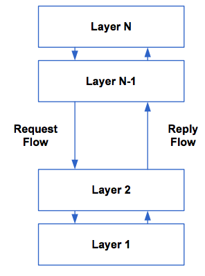
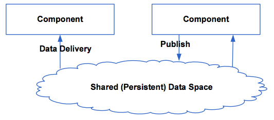
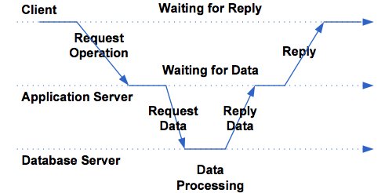
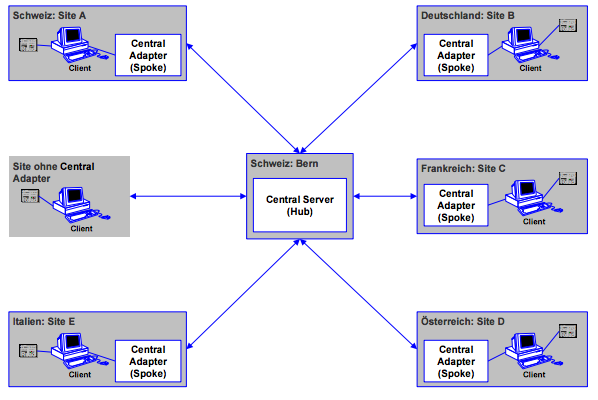
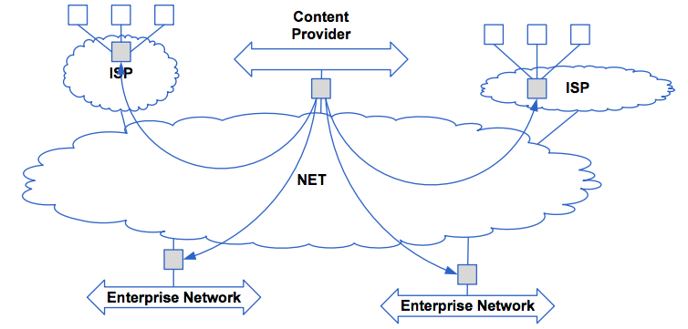

#Lektion 2

####Inhalt
1. Architekturarten
2. Zentrale verteilte Systemarchitekturen
3. Dezentrale verteilte Systemarchitekturen
4. Hybride verteilte Systemarchitekturen
5. Architekturen und Middleware
6. Autonome Systeme

---
##Wichtigste Arten verteilter Systeme
* Layered Architejturen
* Objektbasierte Architekturen
* Datenzentrierte Architekturen
* Ereignisbasirte Architekturen

####Layered Architekturen

Eigenschaften:

* Stuerung fiesst von schicht zu Schicht (Layers)
* Anforderungen sind von oben nach unten
* Ergebnisse kommen von unten nach open

->  <-

Hinweis: Wann wird der Layer zum Tier wird?

Ein Tier ist grundsätzlich Hardware. Mehrere Layer können auf dem gleichen Tier abgebilded werden. Beispielsweise sind webseiten 2-Tier: das erste Tier ist der Browser, das zweite Tier ist der Webserver und die DB, welche auf der gleichen Maschine laufen.

####Objektbasierten Architekturen

Eigenschaften:

* Lose Koppelung
* Objekt = Komponente mit Schnittstelle
* Remote Procedure Call
* Evt. Separate Objekte als Konnektoren

-><-

Konnektor: Objekt, welches die Aufrufe weiterroutet, z.B. Aufrufe an Webserver (GET,POST)
DTOs sind ebenfalls ein Beispiel

Dies wird anscheinend "**Proxy-Pattern**" genannt

####Datenzentriere Architekturen

Eigenschaften:

* Kommunikation über gemeinsame Datenbasis
* Aktives oder Passives Repository
* Kokkunikation über Dateien
* Auch Aufgaben als Daten gespeichert

-><-

Wenn man eine Datenbank hat werden beispielsweise Trigger gebraucht ist aber keine gute Idee.
Eine bessere Idee ist es das Filesystem zu verwenden.
1. Client schreibt ein file in einen Ordner
2. Host merkt dies und behandelt das File
3. Bei Erfolg oder Error wird ein Log geschrieben in ein entsprechendes Verzeichnis

Problem ist wenn Systeme auf das gleiche File schreiben oder transferieren dies tatsächlich irgendwo hin. Das funktioniert dan nicht mehr. Es ist sehr schwierig diese Architektur zu verwenden.

####Eventbasierte Architekturen

Eigenschaften:
* Wiedergabe von Ereignissen
* Publish / Subscribe Mechanismen
* Entkoppelung (refferenzielle Entkoppelung)
* Können mit Datenzentriereten Architekturen kombiniert werden

Gewinnt an Popularität; Alles was Sensoren messen sind eigentlich Events.
Z.B. Sensor misst was und macht ein Publish mit den neuen Daten alle X Sekunden. Diejenigen Komponenten, welche es interessiert, reagieren dan darauf.

Diese Architektur ist wahrscheinlich die Zukunft.

---

##Zentrale vertteilte Architekturen

####Der Klassiker: Client-Server

Charakteristika:

* Clients requests Serices from servers
* Server: implementiert den Dienst
* Client: Bezieht den Dienst
* EVA: Eingabe - Verarbeitung - Ausgabe

Asynchrone Verarbeitung ist immer sehr schwierig und bringt Overhead. Nur mit Vorsicht einzusetzen, da in 99% der Fälle dies ausreicht. Der grösste Vorteil sind die Latenzzeiten, ist aber meistens vernachlässigbar. Wenn man warten kann, wird mit synchronen Aufrufen die Komplexität ENORM vermindert

Es gibt drei Arten von grundlegenden Aufgaben:

* Präsentation
	* z.B. Browser
	* es wird immer mehr auf den Browser geschoben im Moment
* Funktion
* Daten

Fünf Rollenmodelle:

* Distributed Presentation
	* Server Stellt alle Clients zentral dar und versteckt deren Ursprung
	* Überwachungskameras
	* Remote-Desktop-Zugriffe	
* Remote Presentation
	* Bedeuted das Präsentation nur vom Client übernommen wird
* Distributed Function
	* Die verteilte funktionalität setzt eine Arbeitsteilung auf funktionaler Ebene zw. Client und Server um
* Remote Data
	* Daten sind alle auf einem zentralen Ort zu finden 
* Distributed Data
	* Client greifft auf Daten zu, welche auf verschiedenen Servern verteilt sind.
	
Menschen ohne Erfahrung sagen, es sei einfach diese Modell zu definieren und einzuhalten. Dies ist nicht so; es ist immer schwierig dies umzusetzen. Z.B. "Wohin gehört Logik?"

####Die Erweiterung: Multi-Tier Architektur

* Trennung GUI in Presentation und Display (Browser)
* Trennung Processing in Orchestration und Logic
* Trennung Data in Back-End und DB

-><-

* Mainframe Architecture
	* Zentrale Hostcomputer, Interaktion über ein Terminal
* Filesharing Architecture
	* Ursprüngliche PC-Architektur, Server sendet Daten und Programme an den PC der sie ausführt
* Client/Server Architecture
	* Ersatz der File Sharing Systeme
* Two Tier Architecture
	* 2 Server - N Clients. Ausführung mehrerer Requests durch Prozess-Management (Konzipiert für 12-100 PCs)
* Three Tier Architecture
	* Erweiterung durch Middle Tier, welches Funktionalitäten (Applikationslogik, Queueing, ...) - Skalierbar
* Distributed/Collaborative Enterprise 
	* SOA
	
####Zentrale Hub & Spoke Architektur

Das Charakteristische der Hub & Spoke Architektur ist, dass die einzelnen Kokkunikationsteilnehmer immer über den zentralen Server kommunizieren und dass die Daten sowohl auf dem zentralen Server als auch auf den Spoke Servern gehalten werden.

-><-

---

##Dezentrale verteilte Systemarchitekturen

* Vertikale Verteilung
	* Verteilung logische unterschiedlicher Komponenten auf unterschiedliche Rechner (Arbeitsteilung verschiedener Aufgaben)
	* Entspricht der vertikalen Fragementierung in der DB (Aufteilung von Daten in Tabellen nach Spalten und entsprechende Verteilung auf div. Rechner)
* Horizontale Verteilung:
	* Funktionen sind logisch und physisch über mehrere Rechner verteilt, die auf jeweils separaten Daten arbeiten (Arbeitsteilung gleicher Aufgaben) 

####P2P und Serventes
Eigenschaften:

* Horizontale Verteilung
* Aus logischer Schicht snd alle Prozesse gleich
* Die meisten Interaktionen sind symetrisch
* **Servent**: jeder Prozess ist gleichzeitig Server und Client
* Anordnung in Peer-to-Peer Netzwerken gleichwertiger Knoten
* Benötigt zur Kommunikation so genannte **Overlay-Netzwerke** die ein Verteilung und Finden von Daten und Funktionen im P2P Netzwerk erlauben.

####Overlay Netzwerke
Ein Overlay Netzwerk ist eine Logische Schicht, die oberhaön eines physikalischen Netzwerks implementirt wird.
**Zentrale Eigenschaft**: Jeder Knoten im Overlay Netzwerk ist ebenfalls im psysikallischen Netzwerk vorhanden, aber nicht jeder physische Knoten ist im Overlay Netzwerk implementiert

-><-

Arten:

* Strukturierte
	* Konstruktion erfolgt mittels deterministischem Verfahren; Kommunikation erfolgt über Hash-Table
* Unstrukturierte:
	* Zufällige Konstruktion (Zufälliger Graph). Die Kommunikation erfolgt über ein Überfluten» des Netzwerkes
* Superpeer: 
	* Ein Superpeer Knoten in einem Netzwerk enthält Informationen über andere Knoten, die Kommunikation erfolgt über diese Knoten
	
---

##Hybride Systemarchitekturen

Sie kombinieren die beiden Modelle der zentralen ud dezentralen verteilten Systemarchitekturen

Der Zugriff auf das Dezentral verteilte System erfolgt über ein zentral verteiltes System.

Beispiel: Edge-Server-System (bzw. CDN)

-><-

---

##Architekturen und Middleware

######Was ist Middleware?
Unter Middleware wird die Infrastrukture für die Kommunikation zwischen den Komponnten eines verteilten Systems verstanden (meistens zwischen Darstellung dund Daten)

Die 5 Typen von Middleware sind:

* **Dialogorientiert**: Synchrone Interaktion aller Komponenten
* **Request/Reply**: Entspricht Methodenaufruf
* **Message Passing**: Informationsaustausch durch Meldungen
* **Message Queuing**: Meldungen in Queues (Warteschlagen)
* **Publish/Subscribe**: Rollenmodell für die Kommunikation

Steuerung des Verhaltens

* Interzeptoren
	* Anwendungskomponenten, die in die Kommunikation zwischen zwei Komponenten eingebunden werden
* Separation of Concerns
	* Trennung von Business Logic und den so genannten "Crossctting Concerns"
* Computational Reflection
	* Software kann ihr eigenes Verhalten zu reflektieren und gegebenfalls ändern
* Component-Based Design
	* Dabei wird dynamische und statische komposition unterschieden
	
	
####Computational Reflection

Umfasst 2 Tätigkeiten

* **Introspection**: Die Beobachtungen des eigenen Verhaltens durch ein System
* **Intercession**: Die Aktionen, die auf eine bestimmte Beobachtung hin ausgeläst werden das Verhalten des Systems ändern können

Zwei Arten von Computational Reflection

* **Structural Reflection**: Reflektion auf der ebene von Klassenbäumen und Datentypen. So kann beispielsweise ein Metalevel Objekt ein Basisobjekt auf die verfügbaren Methoden hin untersuchen und die entsprechende geeignete Methode aufrufen.
* **Behaviroural Reflection**: Reflektion auf der Ebene der Semantik einer Komponente. So kann ein verteiltes System mit Behavioral Reflection dasjenige Netzwerk-Protokoll wählen, welches für eine bestimmte Situation (WAN, LAN, Wireless) geeignet ist

---

##Autonome Systeme
Autonomous Systems sind Systeme, die selbständig und kontextbezogen handeln können 

####Eigenschaften eines Autonomen Agenten

* **Autonomie**
* **Interaktiv**
* **Reaktiv**
* **Proaktivität**

####Rückkopplung

Man bekommt Feedback vom System, dieses wird ausgewertet und danach wird das System adaptiert um die Umstände bewältigen zu können.

