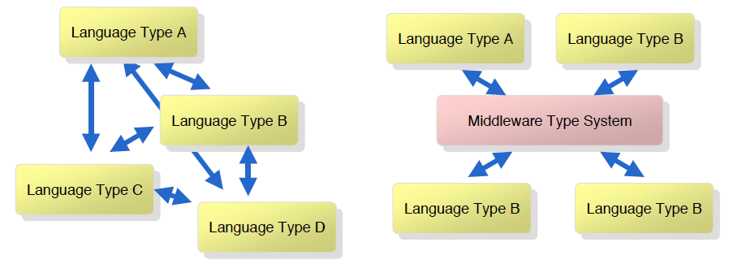
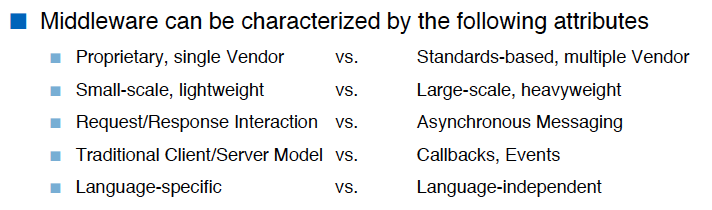
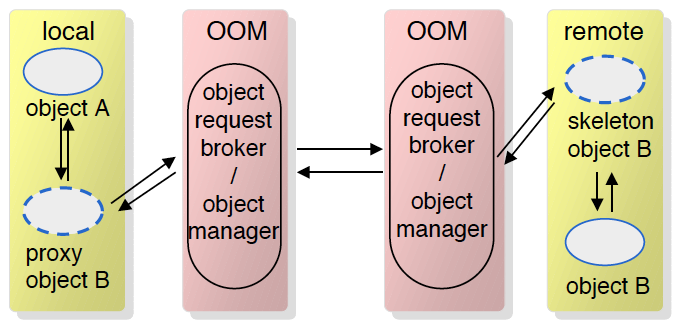

#Lektion 3 - Middleware

##Problems

* Different Languages
* Different APIs
* Diffrennt OSs
* Different Datatypes
* Different Network protocols

##Solution: Middleware

* Layer between OS and distributed Applications
* Hides complexity and heterogenity of distributed system
	* Bridges gap between low.leel OS communications and programming languages
	* provides common programming abstraction
	
Supports:

* Mapping and conversion of common types
* (De)serialization of values
* protocol handling, failure handling, Quality of service
* transactions
* access control, authentication
* interface description language

###Mapping programming language types

-><-

###Serialization and Deserialization

* The concrete values and data structures have to send over the "wire"
* They need to be streamed in and out

###Naming, Location, Service discovery

Before a server service can be called its physical location (machine) has to be found

###Protocol handling, failure handling, QoS

* Remote call is much more error prone
* Some error can be handled by infrastructure

Can be resent again, but that might be a problem for example for bank transactions
=> needs to be idempotent

###Transactions

* often DB access and transactions are involved
* for consistency this requires that Two-Phase-Commit (2PC) is supported
* Transaction Context has to be piggybacked with the data

###Access Control, Authentication

* Credentials have to be checked
* User Id has to be piggybacked with each call

###Lifecycle Service

* Server Services are started on demand
* some instance has the "wake them up"

### Middleware Dimensions

-> <-


###Type of middleware to chose

* the one that meets requirements!

Tradeoffs:

* Simple e.g. language specific -> bound to specific programming language
* Simple e.g. request/response -> no asynchronous calls
* Simple e.g. vendoc specific -> proprietary, vendor locking

Choice of Middleware

* has huge impacts on architecture of all applications
* cannot be changed easily -> lives for YEARS
* has to last several yoears or decates
* will be outdated sometime, vendor supports expires -> plan migration to other Middleware


##Remote procedure calls

* Language-level pattern of function call
* Quality of service are almost not supported
* the call was blockend, which means that the client waits for the server to answer
	* you need to handle the threading yourself

##Object-Oriented Middleware

* Objects can be local or remote
* Objects references can be local or remote
* Remote objects have visible remote interfaces

-><-

##Message-Oriented Middleware

* Cimmunication using (asynchronous) message passing
* Messages stored in message queues
* Various assumptions about message content

-><-

* Must be and is reliable
* Error handling is always hard with asynchronous calls

##Event-Based Middleware aka. Pub/Sub

* Publishers pubish events
* Subscribers express interestin in events
* Event Service notifies interested subscribers of published events
* Events can have arbitrary content (typed) or name/value pairs

##Interface Description Language (IDL)

* Wie beim RPC steht im Zentrum die Definition des Server-Interfaces.
* Die Sprache IDL ist CORBA-spezifisch und „unabhängig“.
* IDL ist selbst objektorientiert (Vererbung).
* Aus einem Stück IDL werden die konkreten Elemente für die jeweilige Plattform generiert.
* Ein ORB kann sowohl IDL-Definitionen als auch deren dazugehörige Implementationen „verwalten“

```
module SomeDBApp {
 module services {
	struct Person {
		string name;
		int ahvnr;
		long balance
	}
exception AlreadyOnLine{};
exception Duplicate{};
interface Server {
 	boolean init(in string sName) raises(AlreadyOnLine);
}
interface someLookup {
 	void doit(in string name, out Person p) raises(Duplicate);
 }
 }
 ...
}

```