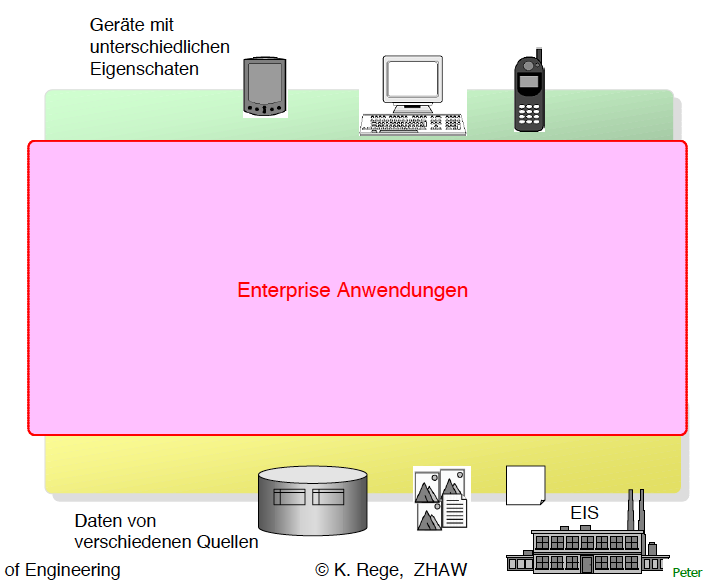
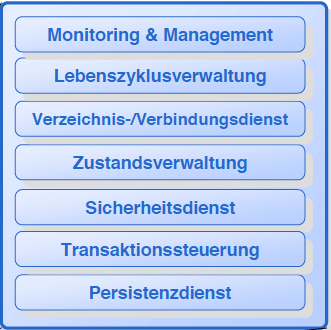

#Lektion 4 - Java Beans

##Ausgangslage

-><-

Es wird nach Aufgaben aufgeteilt:

* Darstellung
* Logik
* Persistenz

Notiz: die meisten Datenbanken heutzutage sind relational.

Man geht davon aus, dass die Lebnsdauer der Schichten sehr unterschiedlich ist. Sofern die einzelnen Layers sauber gestaltet sind, können sie problemlos ausgetauscht werden.

##Komponenten

Komponenten sind Softwaremodule, die auf Binärcodeebene wiederverwendbar sind.
Sie sind kofigurierbar und können einzeln verteilt werden.

Java-Beans sind Komponenten

#EJB-containers

* Stellt Laufzeitumgebung in form von Diensten für Enterprise JavaBeans zur verfügung
* Oracle liefert Spec und Referenzimplementation
* Hersteller sind verpflichtet alle Schnittstellen für EJB's einzuhalten
	* Test Suite
	* Kompatibiliätslogo

-><-

##Monitoring & Management Dienst

In einem betrieblichen Umfeld müssen sverschiedene Infrastrukturkomponenten überwacht und konfiguriert werden

Der Betreiber einer Infrastruktur möchte gerne alle wesentlichen Einstellungen einheitlich auf einem Schirm betrachten und einstellen können.