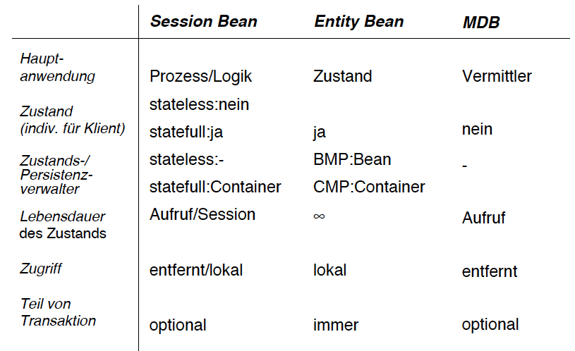

#Lektion 4 - Java Beans

##Ausgangslage

-><-

Es wird nach Aufgaben aufgeteilt:

* Darstellung
* Logik
* Persistenz

Notiz: die meisten Datenbanken heutzutage sind relational.

Man geht davon aus, dass die Lebnsdauer der Schichten sehr unterschiedlich ist. Sofern die einzelnen Layers sauber gestaltet sind, können sie problemlos ausgetauscht werden.

##Komponenten

Komponenten sind Softwaremodule, die auf Binärcodeebene wiederverwendbar sind.
Sie sind kofigurierbar und können einzeln verteilt werden.

Java-Beans sind Komponenten

#EJB-containers

* Stellt Laufzeitumgebung in form von Diensten für Enterprise JavaBeans zur verfügung
* Oracle liefert Spec und Referenzimplementation
* Hersteller sind verpflichtet alle Schnittstellen für EJB's einzuhalten
	* Test Suite
	* Kompatibiliätslogo

-><-

##Monitoring & Management Dienst

In einem betrieblichen Umfeld müssen sverschiedene Infrastrukturkomponenten überwacht und konfiguriert werden

Der Betreiber einer Infrastruktur möchte gerne alle wesentlichen Einstellungen einheitlich auf einem Schirm betrachten und einstellen können.

##Drei Arten von Enterprise Beans

###Session Beans

* Zuständig für Logik
* Entweder stateles oder stateful

####Eigenschaften

* Repräsentiert die Logik
* Ist nicht persistent
* Greifft auf andere Beans zu (Session, Entity ...)
* hat einen leeren Konstruktor
* hat entweder einen Zustand oder keinen
* Wird oft direkt vom Client lokal oder remote aufgerufen
* kann (optional) Teil einer Transaktion sein

###Entity Bean

* Repräsentiert den Zustand ("Geschäftsobjekte")
* ist persistent d.h. überdauern Container Nustart

####Eigenschaften
* Repräsentiert einen Zustand
* persistente Werte von Geschäftsindentitäten
* bei update wirds automatisch in die Datenbank übertragen
* Überlebt die Verbindungszeit und sogar die Container Lebenszeit
* Kann nicht direkt vom Klienten angesprochen werden, sondern muss über lokale SessionBeans angesprochen werden
* Immer Teil einer Trasaktion 

###Message-Driven Bean

* Dienst für Zugriff auf asynchrone Schnittstelle
* Braucht man um mit anderen Systemen zu kommunizieren (Bank -> Bank)

-><-

Die Wahl der Beantypen ist meist relativ offensichtlich.

* Prozess/kein Zustand -> Session Bean
* Mit Zustand als teil von Prozess -> Entity Bean
* Schnittstelle zu einer anderen Bank -> Message Driven Bean

##Aufbau einer EJB

Eine EJB besthet aus einer Menge von Klassen und Interfaces

* Remote und Local interfaces
* Deployment Descriptor
* Hilfsklassen (werden automatisch generiert)

##Zusammenfassung

* Java EE5 ist eine Architektur zur entwicklung von serverseitigen Komponenten
* Archtitektur basiert auf Aufteilung in in die 3 Schichten Präsentation, Logik, Persistenz
* Ermöglicht verteilte Anwendung mit standartisierten Kommunikationsprotokollen

